# Orchestrator Communication Flow Diagram

## A2A Protocol - Agent Communication Architecture

```mermaid
graph TB
    %% User Interface Layer
    User[👤 User] --> UI[🖥️ UnifiedChat Component]
    UI --> API[🌐 Next.js API Routes]

    %% API Routes
    API --> |POST /api/orchestrator| Orchestrator[🎯 Orchestrator Service]
    API --> |POST /api/deepseek| DeepSeekAPI[🤖 DeepSeek API Route]

    %% Orchestrator Decision Making
    Orchestrator --> |1. Classify Request| Classifier[🧠 DeepSeek Classifier]
    Classifier --> |quiz/manual/chat| Decision{🎯 Route Decision}

    %% Routing Logic
    Decision --> |quiz| BackendRoute[📋 Route to Backend Agent]
    Decision --> |manual| ManualRoute[📖 Route to Manual Generator]
    Decision --> |chat| ChatRoute[💬 Route to DeepSeek Chat]

    %% Backend Agent Communication
    BackendRoute --> |HTTP POST| BackendAgent[🏗️ Quiz Creator Agent<br/>Port 4001]
    BackendAgent --> |A2A Task Response| BackendResponse[📊 Quiz Data]
    BackendResponse --> |Fallback| DeepSeekFallback[🔄 DeepSeek Quiz Fallback]

    %% Manual Generator
    ManualRoute --> |Direct API Call| ManualGenerator[📚 DeepSeek Manual Generator]
    ManualGenerator --> |Manual Data| ManualResponse[📄 Manual Content]

    %% Chat Route
    ChatRoute --> |Direct API Call| ChatGenerator[💭 DeepSeek Chat Generator]
    ChatGenerator --> |Chat Response| ChatResponse[💬 Chat Message]

    %% Response Handling
    DeepSeekFallback --> ResponseHandler[📝 Response Handler]
    ManualResponse --> ResponseHandler
    ChatResponse --> ResponseHandler

    %% Data Flow Back to UI
    ResponseHandler --> |Structured Response| UI
    UI --> |Display Content| User
    UI --> |Save to localStorage| Storage[💾 Local Storage]

    %% Styling
    classDef userClass fill:#e1f5fe,stroke:#01579b,stroke-width:2px
    classDef uiClass fill:#f3e5f5,stroke:#4a148c,stroke-width:2px
    classDef apiClass fill:#e8f5e8,stroke:#1b5e20,stroke-width:2px
    classDef orchestratorClass fill:#fff3e0,stroke:#e65100,stroke-width:3px
    classDef agentClass fill:#fce4ec,stroke:#880e4f,stroke-width:2px
    classDef responseClass fill:#e0f2f1,stroke:#004d40,stroke-width:2px
    classDef storageClass fill:#f1f8e9,stroke:#33691e,stroke-width:2px

    class User userClass
    class UI uiClass
    class API,DeepSeekAPI apiClass
    class Orchestrator,Classifier,Decision orchestratorClass
    class BackendAgent,ManualGenerator,ChatGenerator agentClass
    class BackendResponse,ManualResponse,ChatResponse,DeepSeekFallback,ResponseHandler responseClass
    class Storage storageClass
```



## Communication Flow Details

### 1. **Request Classification Flow**

```
User Input → UnifiedChat → /api/orchestrator → Orchestrator Service
    ↓
DeepSeek Classifier (sk-6796ea0f38c7499dbf47c7ff2a026966)
    ↓
Classification Result: "quiz" | "manual" | "chat"
```

### 2. **Quiz Generation Flow**

```
Quiz Request → Backend Agent (Port 4001)
    ↓
A2A Task Execution (/a2a/tasks endpoint)
    ↓
Quiz Creator Service → OpenAI API
    ↓
Quiz Data Response
    ↓
Fallback to DeepSeek if Backend Fails
```

### 3. **Manual Generation Flow**

```
Manual Request → DeepSeek Manual Generator
    ↓
Direct API Call to DeepSeek API
    ↓
Technical Writing Prompt
    ↓
Structured Manual Response
```

### 4. **Chat Flow**

```
Chat Request → DeepSeek Chat Generator
    ↓
Direct API Call to DeepSeek API
    ↓
General Conversation Response
```

## Agent Communication Protocols

### **A2A Protocol Communication**

- **Frontend Agent**: Next.js Application (Port 3000)
- **Backend Agent**: Express.js Quiz Creator (Port 4001)
- **Communication**: HTTP POST to `/a2a/tasks`
- **Message Format**: A2A Message Structure with parts array

### **Direct API Communication**

- **DeepSeek API**: Direct OpenAI-compatible calls
- **Base URL**: `https://api.deepseek.com`
- **Model**: `deepseek-chat`
- **Authentication**: API Key in server-side routes

## Error Handling & Fallbacks

### **Backend Agent Fallback Chain**

1. **Primary**: Backend Agent (Port 4001)
2. **Fallback 1**: DeepSeek Quiz Generator
3. **Fallback 2**: Ultimate Fallback Quiz (Hardcoded)

### **Response Structure**

```typescript
{
  type: "quiz" | "manual" | "chat",
  result: {
    data: QuizData | ManualData | ChatResponse
  },
  agentId: string,
  chatHistory: ChatMessage[]
}
```

## Data Persistence

### **Local Storage Integration**

- **Key**: `savedQuizAndManualItems`
- **Auto-Save**: Generated content automatically saved
- **Auto-Load**: Content restored on component mount
- **Filter**: Only quiz and manual items persisted

## Security Considerations

### **API Key Protection**

- **Client-Side**: No API keys exposed
- **Server-Side**: DeepSeek API key in Next.js API routes
- **Environment**: Secure server-side execution

### **CORS & Network**

- **Same-Origin**: Frontend and API routes same domain
- **HTTP Calls**: Direct communication between services
- **Error Handling**: Graceful degradation on failures
